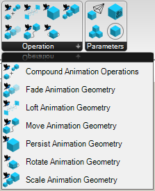

# Manakin
___

> A Grasshopper plugin that helps you create animation frames. 

## Design
Creating animations in Grasshopper can be a pain and I wanted a set of components or a workflow that would make that process easier.

Since there are already some render and animation functions in Grasshopper/Rhino like the animate slider function or the Render materials in viewport. I didn't want to re-invent the wheel or to fight with any of these functions. 

So this plugin will work off those functions and instead try to make working with them easier.

Unlike traditional animation programs, creating animations in Grasshopper is done on a frame-by-frame basis. So instead of working with time, you are actually working with frames. This plugin doesn't stitch the frames and give you a video, you have to do that in another software. This plugin however does make creating those frames easier. 

> This plugins embraces a "be there at the right time and right place" philosophy. Meaning all of it's operation is to put the camera and the geometry at the right place for the right frame. 

To create an animation with Manakin, there are 3 high level steps to follow.

### Step 1: Create animation geometry
The first step is to create an "Animation Geometry". Which is just any geometry in Grasshopper/Rhino with a material assigned to it. 

### Step 2: Assign an animation operation
Then, it's to configure how you want to animate that geometry. Do you want to move it? rotate it? Scale it ? 

Here's a list of operations you can do in Manakin. 

### Step 2b (Optional): Assign camera positions
Then, if you want, you can also configure how the camera will move during the animation. 

### Step 3: Animate Frames
Finally, you can creating the frames for the animationg.

## Dependencies
In the spirit of not re-inventing the wheel, this plugin depends on other plugins to create animations. Specifically: 

- [Human](https://www.food4rhino.com/en/app/human) for setting materials to geometry in Grasshopper
- [Horster](https://www.food4rhino.com/en/app/horster-camera-control-grasshopper) for controlling and getting the position of the camera in the Rhino viewport

At the moment, there are some issues with using these plugins but until they actually break the workflow, I didn't think it was worthwhile to create my own implementation. Not yet anyways. 

## Example file 
When you download the plugin from Food4Rhino, it should come with sample files. 

## Contact 
If there are any issues with the plugin, feel free to leave a comment on the Food4Rhino page or put a feature / issue in the Github page.

